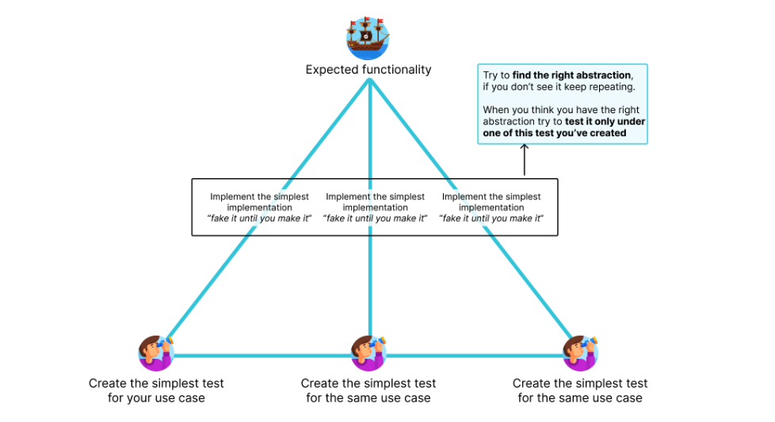
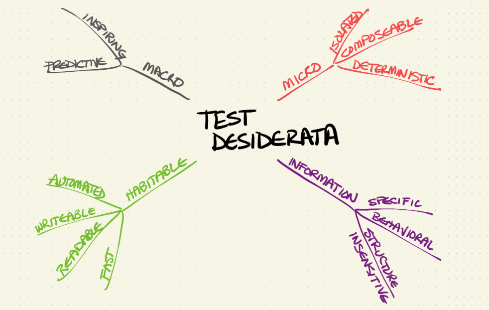

</a>
# Kata-Bootstrap: PHP

| [Open in GitHub Codespace](https://github.com/codespaces/new?hide_repo_select=true&repo=rradczewski%2Fkata-bootstraps&ref=php) | [Open in GitPod.io](https://gitpod.io/#https://github.com/rradczewski/kata-bootstraps/tree/php) | [Open locally in VSCode](https://rradczewski.github.io/kata-bootstraps/redirect.html?url=vscode%3A%2F%2Fvscode.git%2Fclone%3Furl%3Dhttps%253A%252F%252Fgithub.com%252Frradczewski%252Fkata-bootstraps.git%26ref%3Dphp) |
|---|---|---|

## Test Command

```sh
$ composer test
```

## References

- [PHP Getting Started](https://www.php.net/manual/en/getting-started.php)
- [PHP Language Reference](https://www.php.net/manual/en/langref.php)
- [PHP Language Reference](https://www.php.net/manual/en/langref.php)
- [Packagist (Registry)](https://packagist.org/)

---

<div align="center">
    <h3>Test-Driven Development</h3>
    <br>
</div>

<div align="center">
    <h3>The 3-repetition rule on TDD - Triangulation</h3>
    <br>
</div>

<div align="center">
  <h3>Example mapping</h3>
  <br>
</div>

<div align="center">
  <h3>Test Desiderata</h3>
  <br>
</div>

---

## Katas

### 1. [Rock paper scissors](https://hackmd.io/@evalverde/ipc-remote-kata-1)

- TDD Cycle
- Baby steps
- Triangulation

### 2. [Password validator kata](https://www.codurance.com/katas/password-validation)

- Example Mapping
- TDD Cycle
- Baby steps
- Triangulation
- Test desiderata

### 3. [Guess the random number](https://www.codurance.com/katas/random-number-kata)

- CRC cards
- Mock it if you own it
- Collaborators
- Solitary or Sociable test
- Triangulation
- Test desiderata

### 4. [Morning Routine](https://www.codurance.com/katas/morning-routine-kata)

- CRC cards
- Mock it if you own it
- Collaborators
- Triangulation
- Test desiderata

---

## Resources

- [Presentation Slides](https://docs.google.com/presentation/d/1GEgpVZVW68GualHnSCkDgPdFxhvyzWuUBb4gLhm8Y0Q/edit?usp=sharing)

### Books

- **Agile Technical Practices Distilled** by Pedro M Santos ([Amazon](https://www.amazon.de/-/en/Pedro-M-Santos/dp/1838980849/))
- **Test-Driven Development by Example** by Kent Beck ([Amazon](https://www.amazon.de/-/en/Kent-Beck/dp/0321146530/))
- **Refactoring** by Martin Fowler ([Amazon](https://www.amazon.de/-/en/Martin-Fowler/dp/0134757599/))
- **Growing Object-Oriented Software, Guided by Tests** by Steve Freeman, Nat Pryce ([Amazon](https://www.amazon.de/-/en/Steve-Freeman/dp/0321503627))
- **Working Effectively with Legacy Code** by Michael C. Feathers ([Amazon](https://www.amazon.de/-/en/Michael-C-Feathers/dp/0131177052/))

### Videos

- [Does TDD Really Lead to Good Design?](https://youtu.be/KyFVA4Spcgg)
- [Introduction to Test Driven Development](https://youtu.be/04FzlrMKPTM)

### Posts

- [The art of testing: where design meets quality](https://chemaclass.com/blog/the-art-of-testing/)
- [Test-Driven (Development) - What is challenging about it?](https://chemaclass.com/blog/test-driven-development/)
- [TDD vs BDD - Design or Workflow?](https://chemaclass.com/blog/tdd-vs-bdd/)
